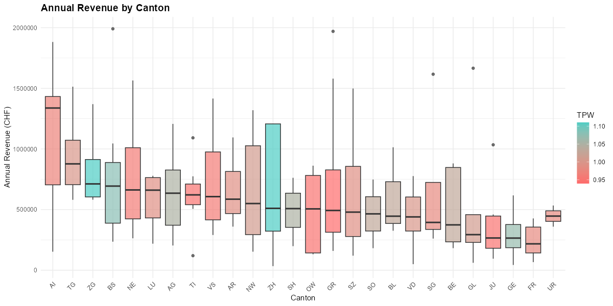
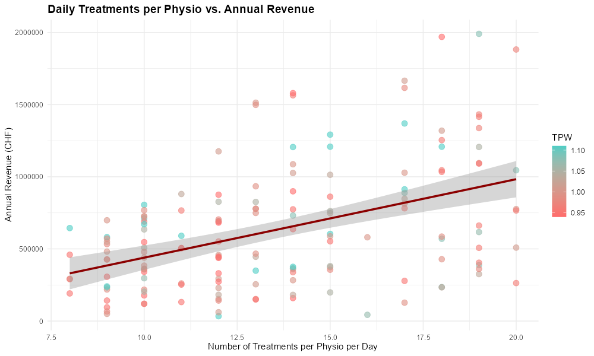

# 🇨🇭 Physiotherapy Practice Revenue Simulation – Switzerland

A reproducible data-science project exploring how physiotherapy practices in Switzerland might generate revenue under canton-specific tariff systems (TPW 2024, KVG), different service mixes, and staffing scenarios.

This project combines **healthcare domain knowledge**, **Monte-Carlo simulation**, and **regression analysis** to study what really drives revenue variation between practices.

---

################## Why This Project Exists #############################

Physiotherapy practices operate under complex tariff structures that differ by canton and treatment type.  

I built this project to explore:

- How much revenue practices *could* generate under different staffing models  
- How canton-level tariff multipliers affect income  
- Which treatments contribute most to revenue  
- How sensitive revenue is to patient volume  
- Where the biggest uncertainties lie

All data-generation assumptions are clearly documented, and the model focuses on **exploration rather than prediction**.

---

########################### Objective ###########################

Simulate annual revenue for 160 hypothetical Swiss physiotherapy practices while varying:

- Canton-specific tariff multipliers (TPW 2024)
- Treatment mix probabilities
- Number of physiotherapists per practice
- Daily treatment volumes
- Optional supplementary charges

The goal is not to forecast real-world income, but to **understand revenue drivers and structural differences** in a transparent, reproducible way.

---

######################## Data & Sources ##############################

### Main Treatments (Tarif 7301–7340)

| Tarif | Treatment | Points | Probability |
|------|---------|--------|------------|
| 7301 | General Physiotherapy | 48 | 50% |
| 7311 | Complex Kinesiotherapy | 77 | 15% |
| 7312 | Manual Lymph Drainage | 77 | 10% |
| 7313 | Hippotherapy | 77 | 2% |
| 7320 | Electro & Thermotherapy | 10 | 8% |
| 7330 | Group Therapy | 25 | 10% |
| 7340 | Medical Training Therapy | 22 | 5% |

### Canton Multipliers (TPW 2024, KVG)

26 Swiss cantons with TPW values ranging from **0.94** to **1.11**.

> Source attribution: TPW values are provided directly in the script and attributed to Physioswiss by the author; they are not independently verified by the code.

### Supplementary Charges

Eight optional supplements are modeled:

- **Point-based supplements** (e.g., first consultation)
- **Annual CHF supplements** (e.g., material flat fees)

Both are triggered stochastically and documented as modeling assumptions.

---

####################### Methodology #######################

### Simulation Design

The following parameters are **synthetic expert assumptions**:

- Physiotherapists per practice: 1–6  
- Daily treatments per physio: 8–20  
- Treatment types drawn from service mix probabilities  
- Canton assigned uniformly

---

#################### 📈 Results at a Glance ######################

### "Overall Revenue Distribution"

### "Revenue by Canton" 

### "Physios vs revenue"

### "Treatments vs revenue"

### "Sensitivity Analysis"

